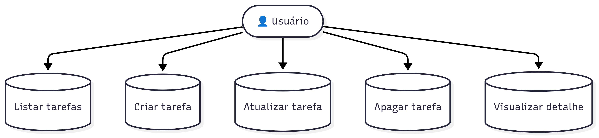
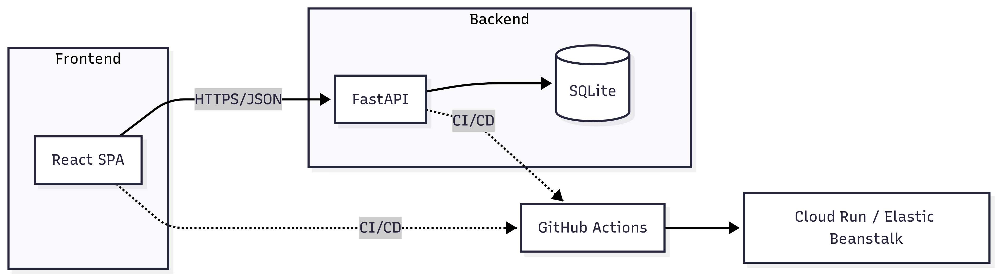

# 📋 Task Manager API

Backend da aplicação **Task Manager** desenvolvida como desafio técnico.  
A API foi construída com **FastAPI** e utiliza **SQLite** como banco de dados.  
O frontend será desenvolvido separadamente em React.

---

## 🚀 Funcionalidades

- Criar tarefas
- Listar todas as tarefas
- Atualizar uma tarefa
- Apagar uma tarefa
- Visualizar detalhes de uma tarefa

---

## 🛠️ Tecnologias Utilizadas

- **FastAPI** (Python)
- **SQLModel** (ORM sobre SQLAlchemy + Pydantic)
- **SQLite** (Banco de dados relacional)
- **Uvicorn** (Servidor ASGI)
- **Pytest** (Testes unitários e de integração)
- **GitHub Actions** (CI/CD)

---

## 🗂️ Diagramas

### Diagrama de Caso de Uso



### Diagrama de Arquitetura



## ⚙️ Como Rodar Localmente

### 1. Clone o repositório:

```bash
git clone https://github.com/seu-usuario/task-manager-api.git
cd task-manager-api
```

### 2. Crie e ative o ambiente virtual:

```bash
python -m venv .venv
.venv\Scripts\Activate.ps1   # no Windows (PowerShell)
source .venv/bin/activate    # no Linux/Mac
```

### 3. Instale as dependências:

```bash
pip install -r requirements.txt
```

### 4. Rode a API:

```bash
uvicorn app.main:app --reload
```

### 5. Acesse no navegador:

```bash
http://127.0.0.1:8000/docs
```

## 🧪 Rodando os Testes
```bash
pytest -q
```

## 🚀 CI/CD (GitHub Actions)

- Pipeline configurado em .github/workflows/ci-cd.yml
- A cada git push:
  - Instala dependências
  - Roda testes (pytest)
  - Prepara aplicação para deploy no GCP
